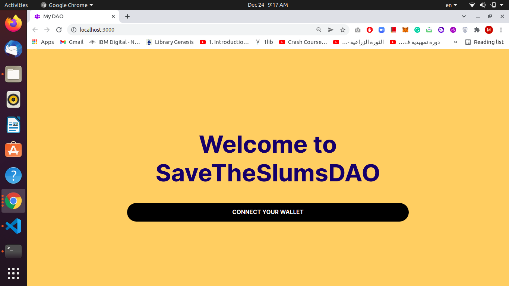
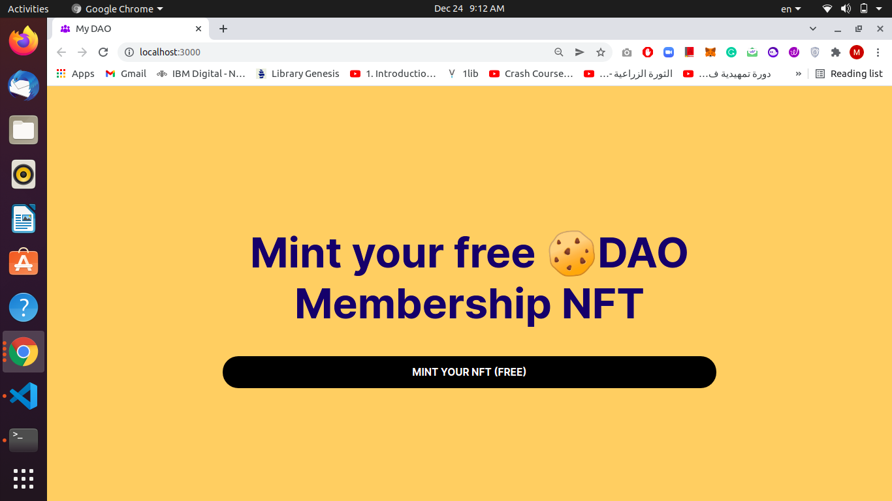
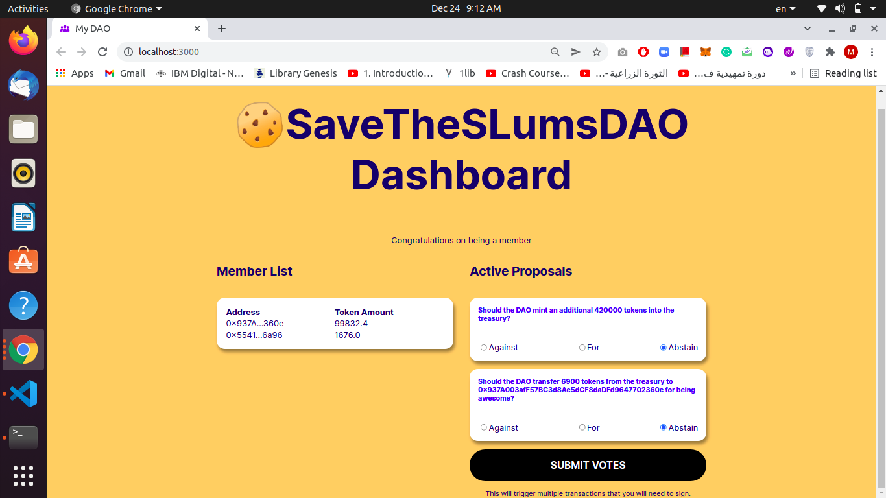

# A DAO built using only Javascript (buildspace x thirdweb)

  |   |  

## Deployed Contracts On Rinkiby:
1) ERC-1155 contract: 0xA34aC69a1ca124638908094d7f26Ba21Dd6f777b
2) ERC-20 Governance Token: 0x78Bd0EAf378172398D638bb0Bec51017ED3010ba
3) Voting Contract: 0xFBeE518dfF8E3f8b37AD57be800c03F89E884c3c

## Instructions:
- npm install
- npm run start
- You can use (node ./scripts/7-airdrop-token) to airdrop governance tokens to DAO members.
- Connect your wallet
- Mint an ERC-1155 NFT to join the DAO
- Vote for Proposals!

## Deployed Dapp:
Link: ()